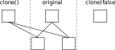

# Examples for Supported Interface

The following snippets show the support of PODIO for the different use cases as
well as some potential pitfalls. These examples are mainly concerned with how
collections of objects and the objects themselves interact. As such they are
framework agnostic.

## Object Ownership

Every data created is either explicitly owned by collections or automatically garbage-collected. There is no need for any `new` or `delete` call on user side.
As a general rule: **If an object has been added to a collection, the collection
assumes ownership and if the collection goes out of scope all handles that point
to objects in this collection are invalidated as well.**

## Object Creation and Storage

Objects and collections can be created via factories, which ensure proper object ownership:

```cpp
    auto hits = HitCollection{};
    auto hit1 = hits.create(1.4,2.4,3.7,4.2);  // init with values
    auto hit2 = hits.create(); // default-construct object
    hit2.energy(42.23);
```

In addition, individual objects can be created in the free. If they aren't attached to a collection, they are automatically garbage-collected:

```cpp
    auto hit1 = Hit();
    auto hit2 = Hit();
    ...
    hits.push_back(hit1);
    ...
    <automatic deletion of hit2>
```

In this respect all objects behave like objects in Python.

## Object References

The library supports the creation of one-to-many relations:

```cpp
    auto hits = HitCollection{};
    auto hit1 = hits.create();
    auto hit2 = hits.create();
    auto clusters = ClusterCollection{};
    auto cluster = clusters.create();
    cluster.addHit(hit1);
    cluster.addHit(hit2);
```

The references can be accessed via iterators on the referencing objects

```cpp
    for (auto i = cluster.Hits_begin(), \
         end = cluster.Hits_end(); i!=end; ++i){
      std::cout << i->energy() << std::endl;
    }
```

or via direct accessors

```cpp
    auto size = cluster.Hits_size();
    auto hit  = cluster.Hits(<aNumber>);
```

If asking for an entry outside bounds, a `std::out_of_range` exception is thrown.

## Subset collections
Subset collections in podio enable you to create collections whose elements are
references to objects stored in one or more original collections:

```cpp
auto subsetColl = MyCollectionType();
subsetColl.setSubsetCollection();
subsetColl.push_back(originalCollection[0]);
```

Other than having to call `setSubsetCollection` and `push_back` for adding
elements from another collection, subset collections behave like regular
collections. See [subset collections](advanced_topics.md#subset-collections) for
more details.


## Looping through Collections
Looping through collections is supported in two ways. Via iterators:

```cpp
    for(auto i = hits.begin(), end = hits.end(); i != end; ++i) {
      std::cout << i->energy() << std::endl;
    }
```

and via direct object access:

```cpp
    for(int i = 0, end = hits.size(), i != end, ++i){
      std::cout << hit[i].energy() << std::endl;
    }
```


## Constructing Collections from Ranges

PODIO collections can be constructed from any compatible range (i.e. at least
`std::input_range`) using the static `from` method or the tagged range
constructor (C++23).

::::{note}
PODIO collections themselves are compatible ranges.
::::

### Basic Usage

```cpp
// Create a collection from a vector of mutable objects
std::vector<MutableExampleCluster> clusters(10);
auto clusterColl = ExampleClusterCollection::from(clusters);

// Create a subset collection from immutable objects
const auto subset = ExampleClusterCollection::from(std::as_const(clusterColl));
```

The `from` method accepts any C++20 input range whose elements are convertible
to the collection's handle type. It automatically determines whether to create a
normal (owned) collection or a subset collection based on the element type:

- **Ranges of mutable handles** → Creates a normal collection that owns the objects
- **Ranges of immutable handles** → Creates a subset collection (non-owning view)

::::{warning}
Depending on the ownership of the handles in the input range it is possible that
this constructor throws as it uses `push_back` internally. Concretely, mutable
handles must not be owned by another collection already and immutable handles
must be owned by another collection already.
::::

### Range Pipeline Integration (C++23)

When compiled with C++23 ranges support, collections support the standard
`std::ranges::to` interface via a tagged constructor:

```cpp
#include <ranges>

// Create from a ranges pipeline
auto coll = std::views::iota(0, 5)
    | std::views::transform([](auto v) { return MutableExampleCluster(v); })
    | std::ranges::to<ExampleClusterCollection>();

// Create subset from a view
const auto subset = coll
    | std::views::take(2)
    | std::ranges::to<ExampleClusterCollection>();
```

This provides seamless integration with the C++ ranges library, enabling
functional-style collection construction.


## Cloning objects

In order to clone objects it is necessary to use the `clone` method which
returns a `Mutable` object again. `clone` takes a parameter `cloneRelations`
which is defaulted to `true`. By default the relation information of the
original object is simply copied over, changing this to `false` only copies the
data but none of the relations.



## Support for Notebook-Pattern

The `notebook pattern` uses the assumption that it is better to create a small
copy of only the data that are needed for a particular calculation. This
pattern is supported by providing access like

```cpp
    auto x_array = hits.x();   // returning all values
    auto y_array = hits.y(10); // or only the first 10 elements
```

The resulting `std::vector` can then be used in (auto-)vectorizable code.
Passing in a size argument is optional; If no argument is passed all elements will be returned,
if an argument is passed only as many elements as requested will be returned.
If the collection holds less elements than are requested, only as many elements as are available will be returned.

## `podio::Frame` container

The `podio::Frame` is the main container for containing and grouping collections
together. It has two main methods:

```cpp
    /// Store a collection
    template<typename T>
    const T& put(T&& coll, const std::string& name);

    /// access a collection
    template<typename T>
    const& T get(const std::string& name);
```

Note that for `put`ting collections into the Frame an explicit `std::move` is
necessary to highlight the change of ownership that happens in this case.

## Object Retrieval

Collections can be retrieved explicitly:

```cpp
    try {
      auto& hits = frame.get<HitCollection>("hits");
    } catch (const std::runtime_error&) {
      // The collection "hits" does not exist or isn't a HitCollection
    }
```

Or implicitly when following an object reference. In both cases the access to data that has been retrieved is `const`.


## User defined Meta Data

Sometimes it is necessary or useful to store additional data that is not directly foreseen in the EDM.
This could be configuration parameters of simulation jobs, or parameter descriptions like cell-ID encoding etc. PODIO currently allows to store such meta data in terms of a `GenericParameters` class that
holds an arbitrary number of named parameters of type `int, float, string` or vectors if these.
Meta data can be stored and retrieved from the `Frame` via the templated `putParameter` and `getParameter` methods.

## Python Interface

The `Reader` and `Writer` classes in the `root_io` and `sio_io` submodules
provide all the necessary functionality to read and write event files. An
example of reading files looks like this:


```python
    from podio.root_io import Reader
    reader = Reader("one or many input files")
    for event in reader.get("events"):
      hits = store.get("hits")
      for hit in hits:
        # ...
```
