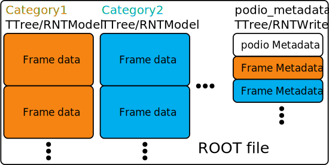
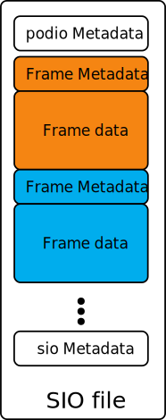

# Storage details of files produced by podio

This page describes some of the details of how podio stores data of generated
EDMs and related metadata on file for the different backends.

```{warning}
We in general do not treat the file layout part of the public API for podio.
This means that if you rely on exact details of a given file layout we might
break things. This is especially true for the way we store *podio related metadata*
metadata, e.g. information on collection types, their schema version, or the
mapping of names to collection IDs. **However, we will limit breaking changes to
cases where it is absolutely necessary.**
```

## ROOT

For ROOT we offer two different options, one based on `TTree`s and one based on
`RNTuple`s. The basic layout of files is largely the same for these two options,
some minor differences are present in the storage of podio related metadata.

The overall structure of a podio generated ROOT file looks like this
- Each category gets its own `TTree` or `RNTupleModel`, where the name is the category name
- Each Frame of a category will be one entry in that.
- The Frame parameters are stored as part of each entry
- An additional `podio_metadata` is created to hold the podio related metadata.

An overview of this schema looks like this



```{note}
For a ROOT based backend all entries of a category have to have the same
(collection) contents. This content is defined by the **first entry that is
written for a category**
```

### Storage of Collection data

Each collection (that is not a subset collection) is decomposed into the
following branches (or fields for `RNTuple`)
- One branch of `std::vector<XYZData>`, with the same name as the collection
- One branch (if any) of `std::vector<T>` per `VectorMember` (of type `T`) with the name `_<collection-name>_<vector-member-name>`
- One branch (if any) of `std::vector<podio::ObjectID>` per `OneToOneRelation` or per `OneToManyRelation` with the name `_<collection-name>_<relation-name>`

If the collection is a subset collection, then there will be only branch (or
field for `RNTuple`) of `std::vector<podio::ObjectID>` with the name `<collection-name>_objIdx`

### Storage of Frame parameters

The Frame parameters are internally handled via `podio::GenericParameters`. For
I/O they are decomposed into pairs of vectors containing the keys and values for
each of the supported generic parameters types. In practice this means that
there will be the following branches per supported type

- One branch of `std::vector<std::string>` holding all the keys with the name of
  `GP<Type>Keys` (where type is one of `Int`, `Float`, `Double` or `String`)
- One branch of `std::vector<std::vector<T>>` holding all the values with the
  name of `GP<Type>Values` (where type is one of `Int`, `Float`, `Double` or
  `String` and `T` is one of `int`, `float`, `double` or `std::string`)

### Storage of podio related metadata

The podio related metadata, stored in the `podio_metadata` `TTree` (or
`RNTupleModel`) contains the following general information once per file

- The version of podio that has been used to write this file
- The complete datamodel definitions for each datamodel that was encountered
  when writing the file

And the following information once per category
- The mapping of collection names to collection IDs
- The types of all the stored collections
- The schema version of all stored collections
- Which collections are stored as subset collections

Here the `TTree` based and `RNTuple` based backends differ slightly in the way
these data are stored exactly. The `TTree` based backend stores the data in a
slightly more structured way, taking advantage of ROOTs capabilities to stream
out more complex object, e.g. the `podio::CollectionIDTable` is streamed as a
whole. The `RNTuple` based backend on the other hand, destructures the
information into separate fields that run in parallel.

## SIO

The SIO based backend stores all Frames as separate (compressed) binary records.
Each record contains the Frame data and the corresponding podio related metadata
to interpret the record. Additionally, it stores one additional record at the
very beginning of the file containing the version of podio that has been used to
write this file. After all records containing Frame data another record is
written that contains some more podio related metadata, e.g. all datamodel
definitions that were encountered when writing the file. This record also
contains a `podio::SIOFileTOCRecordBlock`, which contains information about the
file positions of all Frame records that have been written, allowing for quick
(random) access when reading files again. To find the beginning of this record
the very last bits of the binary record are used to encode the start position of
this record.

Schematically an SIO file written by podio looks like this


